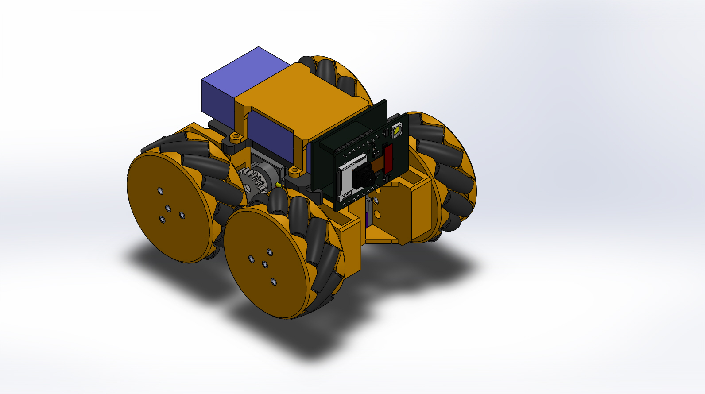

# Mecanum_wheel_vehicle
Based on 3D printed parts and continuous rotation servo motors
The version of solidworks is 2021

 

Positon for the servo motors

 

The version of esp32_arduino is chosen as below

 

